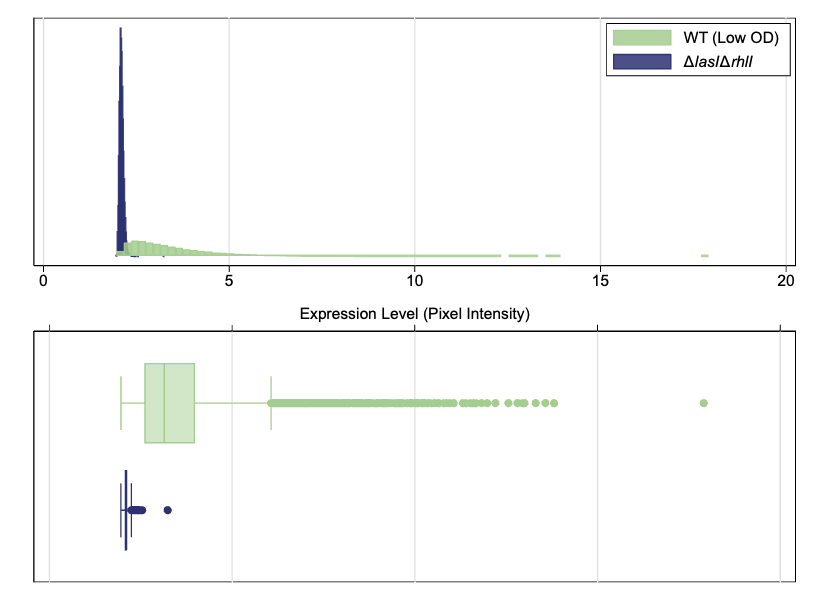
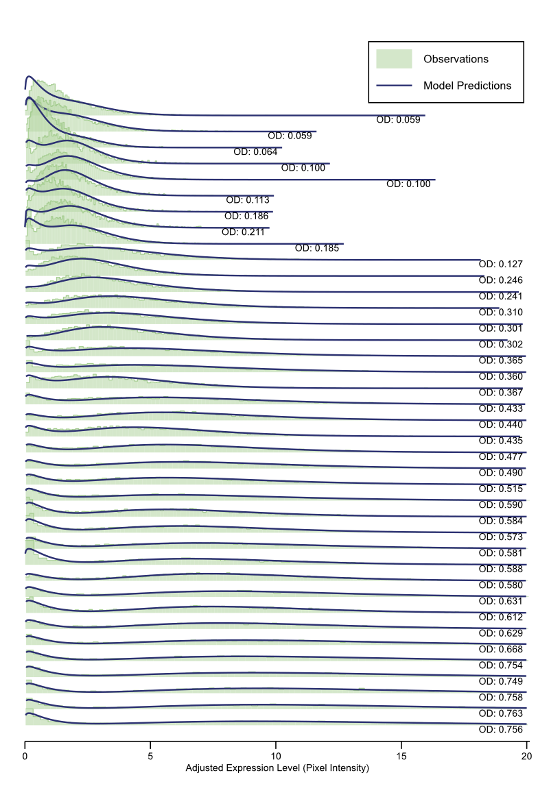
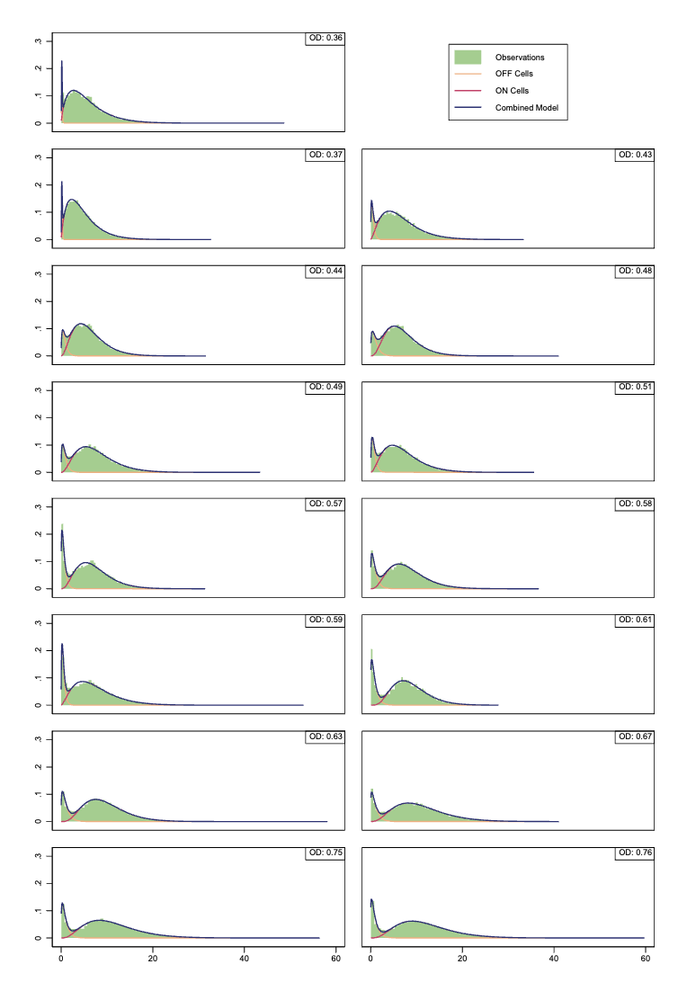
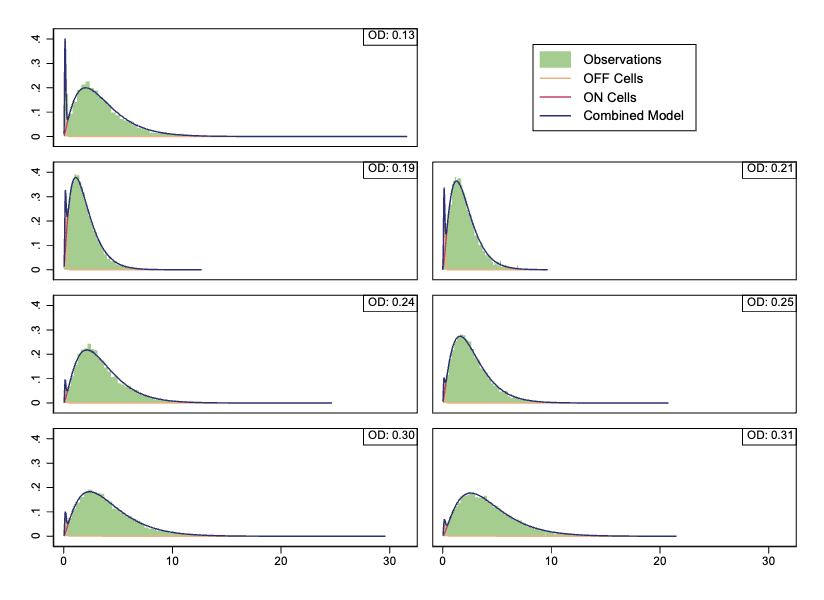
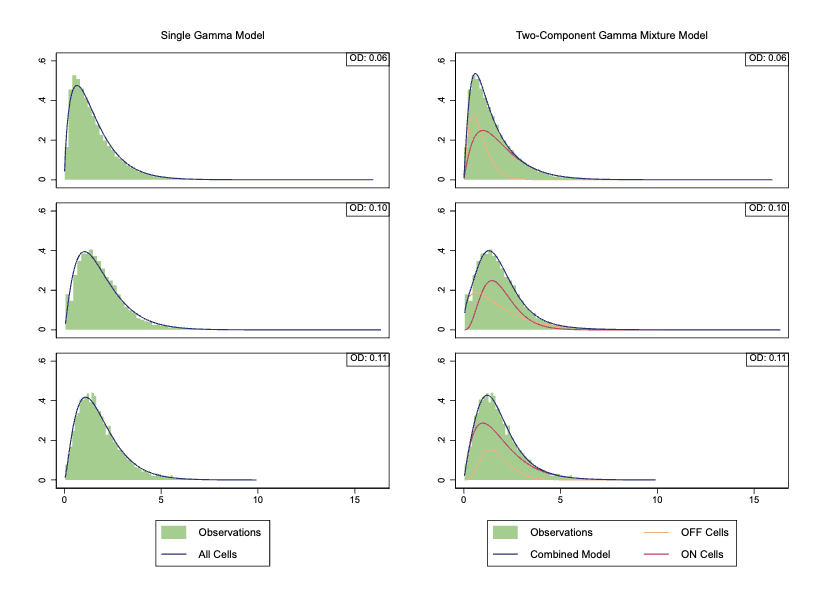
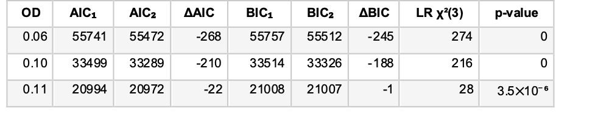

# Analysis Supplement for “Bacterial quorum sensing allows graded and bimodal cellular responses to variations in population density” #

Jennifer B. Rattray (1,2), Stephen A. Thomas (1,2,3), Yifei Wang (1,2,4), Evgeniya Molotkova (1), James Gurney (1,2), John J. Varga (1,2), Sam P. Brown (1,2)

1. School of Biological Sciences, Georgia Institute of Technology, Atlanta, 30332 GA, USA
2. Center for Microbial Dynamics and Infection, Georgia Institute of Technology, Atlanta, 30332 GA, USA
3. Graduate Program in Quantitative Biosciences (QBioS), Georgia Institute of Technology, Atlanta, 30332 GA, USA
4. The Institute for Data Engineering and Science (IDEaS), Georgia Institute of Technology, Atlanta, 30332 GA, USA

The total supplement for this project is: 

Data Supplement (with manuscript)
- Figure S1. Growth curves across different carbon limiting environments
- Figure S2. Microplate population per capita data is graded and linear
- Figure S3. Ridgeline density plot of all single cell _lasB_ reporter response data
- Figure S4. Hartigan’s Dip Test Statistic
- Figure S5. Single cell results are not sensitive to the exact time sampled
- Figure S6. Presence/absence of _Plac::lasR_ and plasmid nature of the reporter do not impact graded QS response
- Figure S7. Population response to density using chromosomal lux-based QS reporters
- Figure S8. Visual summary of single-cell microscopy analysis pipeline
- Table S1. Strains used in this manuscript

Analysis Supplement (on GitHub)
- Figure S9. Comparison of pixel intensity distribution for _ΔlasIΔrhlI_ and wildtype strains
- Figure S10. Two-component Gamma mixture model of expression level distributions overlaid on observation histograms
- Figure S11. Comparing model predictions with observations for optical density values that demonstration statistically significant bimodality
- Figure S12. Comparing model predictions at moderate optical densities
- Figure S13. Comparing a model of a single Gamma distribution to the two-component mixture
- Table S2. Information criteria for single Gamma and two-component Gamma mixture models at low optical densities

**Figure S9. Comparison of pixel intensity distribution for ΔlasIΔrhlI and wildtype strains.** Figure S1 shows the observed pixel intensity measurements for ΔlasIΔrhlI cells in comparison to those for wildtype cells at the lowest measured optical density (OD). As the ΔlasIΔrhlI strain is incapable of synthesizing auto-inducers, it should exhibit minimal _lasB_ expression. The standard deviation is for expression in the wildtype is 1.23. In contrast, pixel intensity for the ΔlasIΔrhlI strain is confined to a very narrow range; its standard deviation is 0.06. These results are consistent with a mutant strain that does not express _lasB_ suggesting that the mutant's pixel intensity is near the measurement sensitivity of the experiment. Indeed, the minimum pixel intensity observed in the mutant is 1.955, a value consistent with the overall minimum observed intensity of 1.952. Treating this value as the measurement limit, we subtract it from all measured intensities so that an intensity of 0 corresponds to no expression. The main text figures use adjusted expression level to indicate the measured pixel intensity after subtracting this minimum value.

**Figure S10. Two-component Gamma mixture model of expression level distributions overlaid on observation histograms.** After having identified two sub-populations of cells (Figure S3, Figure S4) we model the observed _lasB_ expression levels as a two-component finite mixture model. The sub-populations serve as a latent classes in the model. As gene expression level is non-negative and necessarily right-skewed, we use the Gamma distribution to model expression levels of each class [77,78]. We use expectation-maximization [79,80] to find maximum likelihood estimates for the latent class probabilities and Gamma distribution parameters at each density. Our initial model places no constraints on the parameters other than those required by the model structure (i.e. probabilities between 0 and 1, shape and scale positive). Three parameters from the mixture model characterize the sub-populations of cells: the proportion of cells in the ON sub-population and the mean _lasB_ expression levels of the ON and OFF sub-populations. To improve the model’s discriminatory power at low densities, we constrain the OFF sub-population parameters to be those values from the higher densities and update the estimates solely for the ON sub-population. The highest optical density values demonstrate statistically significant bimodality. As expected, the mixture model accurately captures the two sub-populations that make up these distributions. Figure S11 compares these models with the observations.

**Figure S11. Comparing model predictions with observations for optical density values that demonstration statistically significant bimodality.** In addition to the complete model (shown in blue), the plots also show the individual sub-populations of OFF cells (yellow) and ON cells (red). At medium optical density values, the mixture model predictions continue to show close agreement with the observations. Figure S12 highlights this agreement. OD values that don't demonstrate statistically significant bimodality still show the effects of a mixture of two sub-populations. 

**Figure S12. Comparing model predictions at moderate optical densities.** As above, the plots show the individual sub-populations of OFF cells (yellow) and ON cells (red). At the lowest optical densities, the benefits of a mixture model are less clear. Figure S13 illustrates the difficulty by comparing the mixture model with a maximum likelihood fit to a single Gamma distribution. As Table S2 indicates, both Akaike Information Criteria (AIC) and Bayesian Information Criteria (BIC) suggest that the mixture model is superior, but the visual evidence is less compelling.

**Figure S13. Comparing a model of a single Gamma distribution to the two-component mixture.** 
Plots on the right show a single Gamma distribution with maximum likelihood estimates for shape and scale parameters. Plots on the right show the two-component mixture model. Mixture model plots include individual sub-populations of OFF cells (yellow) and ON cells (red). As the figure and table both show, the observations at optical density 0.11 are especially problematic. At that OD, the statistical mode of _lasB_ expression in the ON sub-population is lower than that in the OFF sub-population. As required by the model, however, the mean expression level of the ON sub-population is higher than that of the OFF sub-population.

**Table S2. Information criteria for single Gamma (subscript 1) and two-component Gamma mixture (subscript 2) models at low optical densities.** The Δ columns show change in associated information criteria in two-component model. Final two columns are likelihood ratio and p-value.

